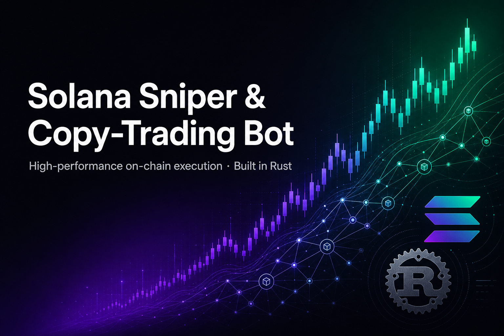
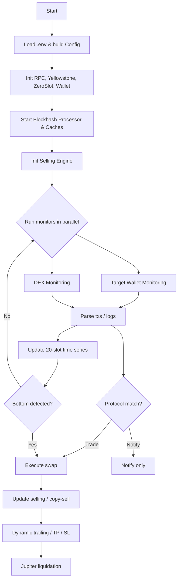

<div align="center">



<h1>Solana Sniper &amp; Copy-Trading Bot</h1>

<p><b>A high-performance Rust bot that watches wallets and DEX activity on Solana in real time and automatically snipes or copies trades - with a built-in risk and selling engine.</b></p>

<p>
  
  
  
  
  
</p>

</div>

---

## Overview

Trading opportunities on Solana open and close in **sub-second windows**. This bot is built for that: it streams on-chain data over **Yellowstone gRPC**, runs multiple monitors in parallel, and executes swaps through low-latency transaction-landing paths - all in Rust for predictable, low-latency performance.

It can **snipe** new launches after a detected drop/bottom, **copy-trade** one or many target wallets, and then manage each position with a configurable **selling engine** (take-profit, stop-loss, and dynamic trailing stops), liquidating through Jupiter.

## Features

- **Real-time monitoring** - Yellowstone gRPC stream with parallel task processing
- **Copy trading** - follow one or many target wallets, with exclusion lists
- **Sniper entries** - per-token 20-slot price/volume time-series with post-drop bottom detection
- **Risk &amp; selling engine** - take-profit, stop-loss, max-hold, and dynamic trailing stops
- **Fast transaction landing** - ZeroSlot or normal mode with configurable priority fees
- **Jupiter liquidation** - quotes and executes token sells via Jupiter
- **Utilities** - wrap/unwrap SOL, close empty token accounts, sell all tokens

## Supported Protocols

| Protocol | Adapter | Status |
| --- | --- | --- |
| Pump.fun | `dex/pump_fun.rs` | Trade |
| PumpSwap | `dex/pump_swap.rs` | Notify (extendable to trade) |
| Raydium Launchpad | `dex/raydium_launchpad.rs` | Trade |
| Raydium AMM | `dex/raydium_amm.rs` | Trade |
| Raydium CPMM | `dex/raydium_cpmm.rs` | Trade |
| Raydium CLMM | `dex/raydium_clmm.rs` | Trade |
| Meteora DBC | `dex/meteora_dbc.rs` | Trade |
| Meteora DAMM | `dex/meteora_damm.rs` | Trade |

## How It Works



## Project Structure

```
src/
  common/        # config, constants, logger, caches, timeseries
  library/       # blockhash processor, jupiter client, rpc, zeroslot, health
  processor/     # monitoring, swap/execution, selling, risk mgmt, parsing
  dex/           # protocol adapters (pump.fun, pumpswap, raydium, meteora)
  block_engine/  # token account & transaction helpers
  error/         # error types
  main.rs        # entrypoint & CLI helpers
```

## Getting Started

### Prerequisites

- Rust toolchain (stable) + Cargo
- A Solana RPC endpoint and a Yellowstone gRPC endpoint

### Install &amp; Run

```bash
# 1. Clone
git clone https://github.com/yuto-kazuma/solana-sniper-bot.git
cd solana-sniper-bot

# 2. Configure environment
cp src/env.example .env
# edit .env with your keys and endpoints

# 3. Build
cargo build --release

# 4. Run
cargo run --release
```

### CLI Helpers

```bash
cargo run --release -- --wrap      # Wrap SOL to WSOL
cargo run --release -- --unwrap    # Unwrap WSOL back to SOL
cargo run --release -- --sell      # Sell all tokens via Jupiter
cargo run --release -- --close     # Close empty token accounts
```

## Configuration

Key environment variables (see `src/env.example` for the full list):

| Variable | Description |
| --- | --- |
| `RPC_HTTP` | Solana HTTP RPC endpoint |
| `YELLOWSTONE_GRPC_HTTP` | Yellowstone gRPC endpoint |
| `YELLOWSTONE_GRPC_TOKEN` | Yellowstone auth token |
| `PRIVATE_KEY` | Base58-encoded wallet keypair |
| `COPY_TRADING_TARGET_ADDRESS` | Comma-separated wallets to follow |
| `IS_MULTI_COPY_TRADING` | Follow multiple wallets (`true`/`false`) |
| `EXCLUDED_ADDRESSES` | Addresses to ignore |
| `TOKEN_AMOUNT` | Buy size per trade |
| `SLIPPAGE` | Slippage in basis points (e.g. `3000` = 30%) |
| `TRANSACTION_LANDING_SERVICE` | `zeroslot` or `normal` |
| `TAKE_PROFIT` / `STOP_LOSS` / `MAX_HOLD_TIME` | Selling-strategy controls |
| `DYNAMIC_TRAILING_STOP_THRESHOLDS` | e.g. `20:5,50:10,100:30,200:100` |

## Tech Stack

`Rust` · `Tokio` · `Solana SDK` · `Anchor` · `Yellowstone gRPC` · `SPL Token` · `Jupiter` · `ZeroSlot`

## Disclaimer

This project is provided for research and educational purposes. Automated on-chain trading carries significant financial risk. Use at your own risk and comply with the terms of any exchange, DEX, and jurisdiction that applies to you.

## License

Released for personal and educational use.

---

<div align="center">
  <sub>Built by <a href="https://github.com/yuto-kazuma">Yuto Kazuma</a> · <a href="https://yuto-kazuma.vercel.app/">Portfolio</a></sub>
</div>
